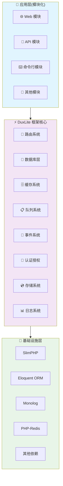

<h1 align="center">DuxLite v2</h1>

<p align="center">
  <strong>🚀 基于 SlimPHP 的现代化 PHP Web 框架</strong>
</p>

<p align="center">
  一个轻量级、高性能的 PHP 框架，专注于快速开发和企业级应用
</p>

<p align="center">
  <a href="https://duxweb.github.io/dux-lite/" target="_blank">📖 中文文档</a> |
  <a href="https://github.com/duxweb/dux-lite" target="_blank">🏠 GitHub</a> |
  <a href="https://www.dux.cn" target="_blank">🌐 官网</a>
</p>

<p align="center">
  
  
  
  
</p>

---

## ✨ 核心特性

* 🚀 **高性能架构** - 基于 SlimPHP 和 Eloquent ORM，轻量级高性能设计
* 🎯 **模块化设计** - 灵活的模块化架构，支持插件式开发和独立部署
* 🛡️ **PSR 标准兼容** - 完全遵循 PSR-7、PSR-11、PSR-15 等现代 PHP 标准
* 📦 **丰富的内置组件** - 缓存、队列、事件、认证、存储等企业级组件开箱即用
* 🔧 **强大的 CLI 工具** - 完善的命令行工具，支持数据库迁移、代码生成、任务调度
* 🎨 **现代化开发体验** - 属性注解、依赖注入、中间件、资源管理等现代特性
* 📝 **完整的中文文档** - 详细的使用指南、API 参考和最佳实践
* 🔒 **企业级安全** - 内置安全防护、异常处理和权限管理机制

## 🏗️ 架构设计



## 📦 核心组件

| 组件模块 | 功能描述 | 访问方式 |
|---------|---------|---------|
| 🧭 **路由系统** | 基于 SlimPHP 的路由管理，支持属性注解和传统定义 | `App::route()` |
| 💾 **数据库层** | 基于 Eloquent ORM 的数据库操作，支持多数据库 | `App::db()` |
| 🗄️ **缓存系统** | 多驱动缓存系统，支持 Redis、文件、内存等 | `App::cache()` |
| 📋 **队列系统** | 异步任务处理，支持数据库、Redis 等驱动 | `App::queue()` |
| 📡 **事件系统** | 事件驱动编程，支持同步和异步事件处理 | `App::event()` |
| 🔐 **认证授权** | 完整的用户认证和权限管理系统 | `App::auth()` |
| 💿 **存储系统** | 统一的文件存储接口，支持本地和云存储 | `App::storage()` |
| 📊 **日志系统** | 基于 Monolog 的日志记录系统 | `App::log()` |

## 🚀 快速开始

### 环境要求

- **PHP**: 8.2 或更高版本
- **扩展**: PDO、JSON、OpenSSL、Fileinfo、Mbstring
- **数据库**: MySQL 5.7+、SQLite 3.8+
- **Web服务器**: Nginx（推荐）、Apache

### 安装

#### 方式一：快速开始模板（推荐）

```bash
# 使用项目模板快速创建新项目
composer create-project duxweb/dux-lite-starter my-app

# 进入项目目录
cd my-app
```

#### 方式二：手动安装框架

```bash
# 使用 Composer 创建新项目
composer create-project duxweb/dux-lite my-app

# 或者在现有项目中安装
composer require duxweb/dux-lite:^2.0
```

### 基础配置

```bash
# 进入项目目录
cd my-app

# 设置目录权限
chmod -R 755 data/
chmod +x dux

# 配置数据库连接
# 编辑 config/database.toml

# 初始化数据库
php dux db:sync
```

### 启动开发服务器

```bash
# 使用 PHP 内置服务器
cd public
php -S localhost:8000

# 访问 http://localhost:8000
```

## 💻 使用示例

### 创建模块

```php
<?php
// app/Web/App.php - Web 模块注册类
namespace App\Web;

use Core\App\AppExtend;
use Core\Bootstrap;

class App extends AppExtend
{
    public function init(Bootstrap $bootstrap): void
    {
        // 模块初始化逻辑
    }

    public function register(Bootstrap $bootstrap): void
    {
        // 注册服务和组件
    }

    public function boot(Bootstrap $bootstrap): void
    {
        // 模块启动逻辑
    }
}
```

### 路由定义

```php
<?php
// 传统路由定义
use Core\App;

App::route()->get('/users', [UserController::class, 'index']);
App::route()->post('/users', [UserController::class, 'store']);
App::route()->get('/users/{id}', [UserController::class, 'show']);

// 属性注解路由
#[Route('/api/users', methods: ['GET'])]
#[Route('/api/users', methods: ['POST'], name: 'users.store')]
class UserController
{
    public function index(ServerRequestInterface $request, ResponseInterface $response): ResponseInterface
    {
        $users = User::paginate(15);
        return response()->json($users);
    }

    public function store(ServerRequestInterface $request, ResponseInterface $response): ResponseInterface
    {
        $data = $request->getParsedBody();
        $user = User::create($data);
        return response()->json($user, 201);
    }
}
```

### 数据库操作

```php
<?php
// 查询构造器
$users = App::db()->table('users')
    ->where('status', 1)
    ->orderBy('created_at', 'desc')
    ->paginate(15);

// Eloquent 模型
class User extends Model
{
    protected $fillable = ['name', 'email', 'password'];
    protected $hidden = ['password'];

    public function posts()
    {
        return $this->hasMany(Post::class);
    }
}

// 模型操作
$user = User::create([
    'name' => '张三',
    'email' => 'zhang@example.com',
    'password' => password_hash('123456', PASSWORD_DEFAULT)
]);

$users = User::with('posts')->where('status', 1)->get();
```

### 缓存使用

```php
<?php
// 基础缓存操作
$cache = App::cache();

// 设置缓存
$cache->set('user:1', $userData, 3600);

// 获取缓存
$userData = $cache->get('user:1');

// 缓存闭包
$users = $cache->remember('users:active', 3600, function() {
    return User::where('status', 1)->get();
});

// Redis 缓存
$redis = App::cache('redis');
$redis->set('session:' . $sessionId, $sessionData, 1800);
```

### 队列任务

```php
<?php
// 定义队列任务
namespace App\Common\Jobs;

use Core\Queue\QueueMessage;

class SendEmailJob extends QueueMessage
{
    public function __construct(
        private string $to,
        private string $subject,
        private string $content
    ) {}

    public function handle(): void
    {
        // 发送邮件逻辑
        $mailer = App::di()->get('mailer');
        $mailer->send($this->to, $this->subject, $this->content);
    }

    public function failed(\Throwable $exception): void
    {
        // 任务失败处理
        App::log()->error('邮件发送失败', [
            'to' => $this->to,
            'error' => $exception->getMessage()
        ]);
    }
}

// 分发任务
App::queue()->push(new SendEmailJob(
    'user@example.com',
    '欢迎注册',
    '欢迎使用 DuxLite 框架！'
));

// 延迟分发
App::queue()->later(300, new SendEmailJob(...));
```

### 事件系统

```php
<?php
// 定义事件监听器
#[Listener('user.created')]
class UserCreatedListener
{
    public function handle($event): void
    {
        $user = $event['user'];

        // 发送欢迎邮件
        App::queue()->push(new SendWelcomeEmailJob($user->email));

        // 记录日志
        App::log()->info('新用户注册', ['user_id' => $user->id]);
    }
}

// 触发事件
App::event()->dispatch('user.created', ['user' => $user]);
```

## 🔧 CLI 工具

DuxLite 提供了强大的命令行工具来提升开发效率：

```bash
# 查看所有可用命令
php dux

# 数据库相关命令
php dux db:sync          # 同步数据库结构
php dux db:list          # 查看数据库列表
php dux db:backup        # 备份数据库
php dux db:restore       # 恢复数据库

# 队列处理命令
php dux queue:work       # 处理队列任务
php dux queue:work --queue=emails  # 处理指定队列

# 路由管理命令
php dux route:list       # 查看所有路由

# 权限管理命令
php dux permission:sync  # 同步权限数据

# 计划任务命令
php dux schedule:run     # 运行计划任务
```

## 🚀 部署指南

### 本地开发环境

推荐使用 [FlyEnv](https://flyenv.com/) 作为本地开发环境：

1. 下载并安装 FlyEnv
2. 启动 Nginx 和 MySQL 服务
3. 配置虚拟主机指向项目 `public` 目录

### 生产环境部署

#### Docker 部署（推荐）

```yaml
# docker-compose.yml
version: '3.8'
services:
  app:
    build: .
    ports:
      - "80:80"
    volumes:
      - ./data:/var/www/html/data
    environment:
      - APP_ENV=production
    depends_on:
      - db
      - redis

  db:
    image: mysql:8.0
    environment:
      MYSQL_ROOT_PASSWORD: ${DB_PASSWORD}
      MYSQL_DATABASE: ${DB_NAME}
    volumes:
      - mysql_data:/var/lib/mysql

  redis:
    image: redis:7-alpine
    volumes:
      - redis_data:/data

volumes:
  mysql_data:
  redis_data:
```

#### 宝塔面板部署

1. 安装宝塔面板：访问 [https://www.bt.cn/](https://www.bt.cn/) 获取最新安装脚本
2. 安装 LNMP 环境（Nginx + MySQL + PHP 8.2+）
3. 创建网站，设置运行目录为 `public`
4. 配置 Nginx 伪静态规则

详细部署说明请参考：[部署指南](https://duxweb.github.io/dux-lite/guide/deployment.html)

## 📚 学习资源

### 📖 官方文档

- **[完整文档](https://duxweb.github.io/dux-lite/)** - 详细的使用指南和 API 参考
- **[快速入门](https://duxweb.github.io/dux-lite/guide/getting-started.html)** - 5分钟上手指南
- **[架构设计](https://duxweb.github.io/dux-lite/guide/overview.html)** - 了解框架设计理念
- **[API 参考](https://duxweb.github.io/dux-lite/api/)** - 完整的 API 文档
- **[最佳实践](https://duxweb.github.io/dux-lite/guide/best-practices.html)** - 开发最佳实践

### 🎯 示例项目

| 项目类型 | 描述 | 链接 |
|---------|------|------|
| **基础应用** | 展示框架基本功能的示例项目 | [查看示例](https://github.com/duxweb/dux-lite-example) |
| **API 应用** | RESTful API 开发示例 | [查看示例](https://github.com/duxweb/dux-lite-api-example) |
| **企业应用** | 完整的企业级应用示例 | [查看示例](https://github.com/duxweb/dux-lite-enterprise-example) |

## 🤝 参与贡献

我们欢迎所有形式的贡献！请查看 [贡献指南](CONTRIBUTING.md) 了解如何开始。

### 贡献方式

1. Fork 本仓库
2. 创建特性分支 (`git checkout -b feature/AmazingFeature`)
3. 提交更改 (`git commit -m 'Add some AmazingFeature'`)
4. 推送到分支 (`git push origin feature/AmazingFeature`)
5. 创建 Pull Request

### 贡献要求

在提交代码前，请确保：
- 代码符合 PSR-12 编码规范
- 添加了必要的测试用例
- 更新了相关文档
- 通过了所有测试

## 📊 项目数据

### 🌟 Star 趋势

[](https://star-history.com/#duxweb/dux-lite&Date)

### 💻 贡献者

感谢所有为 DuxLite 做出贡献的开发者们！

[](https://github.com/duxweb/dux-lite/graphs/contributors)


### 其他联系方式

- 📧 **邮箱**: admin@dux.cn
- 🌐 **官网**: [https://www.dux.cn](https://www.dux.cn)
- 🐛 **问题反馈**: [GitHub Issues](https://github.com/duxweb/dux-lite/issues)
- 💡 **功能建议**: [GitHub Discussions](https://github.com/duxweb/dux-lite/discussions)

## 📄 开源协议

本项目基于 [MIT](LICENSE) 协议开源，您可以自由使用、修改和分发。

## 👥 作者

**DuxWeb 团队**

- 🌐 官网: [https://www.dux.cn](https://www.dux.cn)
- 📧 邮箱: admin@dux.cn
- 🐙 GitHub: [@duxweb](https://github.com/duxweb)

## ⭐ 支持项目

如果这个项目对您有帮助，请给我们一个 ⭐️！

您的支持是我们持续改进的动力。

---

<p align="center">
  <strong>🎉 感谢使用 DuxLite！</strong>
</p>

<p align="center">
  <a href="https://duxweb.github.io/dux-lite/">📖 文档</a> •
  <a href="https://github.com/duxweb/dux-lite/issues">🐛 报告问题</a> •
  <a href="https://github.com/duxweb/dux-lite/discussions">💡 功能建议</a>
</p>