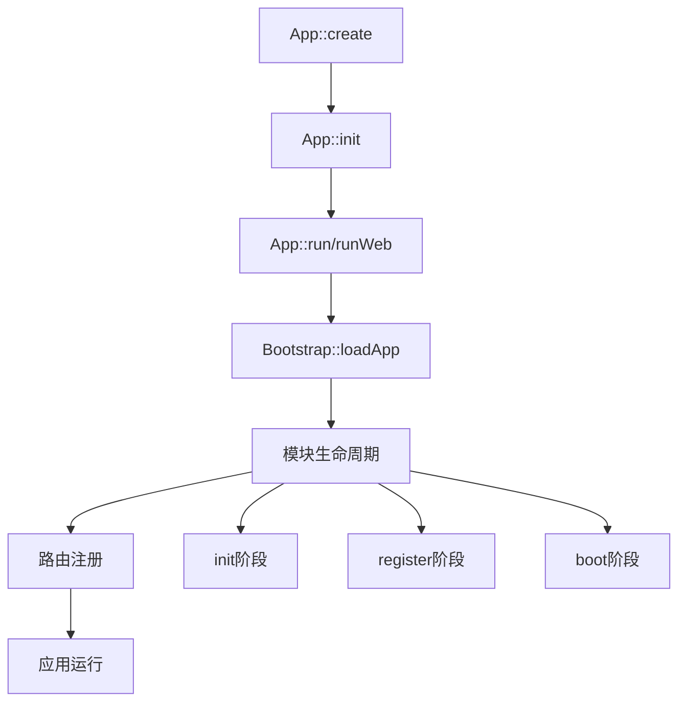

# 应用生命周期

DuxLite 具有清晰的应用生命周期，从应用创建到最终运行，每个阶段都有明确的职责和执行顺序。理解生命周期有助于您在正确的时机执行相应的初始化代码。

## 生命周期概览

DuxLite 应用的完整生命周期可以分为以下几个主要阶段：



## 详细生命周期流程

### 1. 应用创建阶段 (`App::create`)

应用的入口点，设置基本配置和路径。

```php
// public/index.php 或 dux 命令行入口
App::create(
    basePath: dirname(__DIR__),
    lang: 'zh-CN',
    timezone: 'Asia/Shanghai',
    host: "0.0.0.0",
    debug: true,
    logo: ''
);
```

**执行内容：**
- 设置应用基本参数（语言、时区、调试模式等）
- 设置关键路径（配置目录、数据目录、应用目录等）
- 调用 `App::init()` 进行初始化

### 2. 应用初始化阶段 (`App::init`)

```php
public static function init()
{
    // 1. 加载环境变量（可选）
    $dotenv = Dotenv::createImmutable(self::$basePath);
    $dotenv->safeLoad(); // 安全加载，不会覆盖现有变量

    // 2. 初始化依赖注入容器
    self::$di = new Container();

    // 3. 创建 Bootstrap 实例
    self::$bootstrap = new \Core\Bootstrap();

    // 4. 注册基础服务
    self::$bootstrap->registerFunc();    // 注册公共函数
    self::$bootstrap->registerConfig();  // 注册公共配置
    self::$bootstrap->registerWeb();     // 注册 Web 服务
    self::$bootstrap->registerPlugin();  // 注册插件
    Plugin::register(self::$bootstrap);  // 插件初始化
}
```

**执行内容：**
- 🔄 加载环境变量到 `$_ENV` 和 `$_SERVER`
- 🏗️ 初始化依赖注入容器
- ⚙️ 注册全局函数（helper 函数）
- 🌐 初始化时区和语言配置
- 🕸️ 创建 Slim 应用实例

### 3. 应用运行阶段

根据运行模式不同，调用相应的运行方法：

#### Web 模式 (`App::runWeb`)

```php
public static function runWeb()
{
    self::$bootstrap->loadApp();    // 加载应用模块
    self::$bootstrap->loadRoute();  // 加载路由配置
    Plugin::boot(self::$bootstrap); // 插件启动
    self::$bootstrap->runWeb();     // 启动 Web 服务
}
```

#### 命令行模式 (`App::run`)

```php
public static function run()
{
    self::$bootstrap->loadApp();     // 加载应用模块
    self::$bootstrap->loadRoute();   // 加载路由配置
    self::$bootstrap->loadCommand(); // 加载命令行
    Plugin::boot(self::$bootstrap);  // 插件启动
    self::$bootstrap->run();         // 运行命令行
}
```

### 4. 应用加载阶段 (`Bootstrap::loadApp`)

这是最复杂的阶段，包含模块的完整生命周期：

```php
public function loadApp(): void
{
    // 1. 读取模块配置
    $appList = App::config("app")->get("registers", []);

    // 2. 注册模块到全局列表
    foreach ($appList as $vo) {
        App::$registerApp[] = $vo;
    }

    // 3. 模块初始化阶段 (init)
    foreach ($appList as $vo) {
        call_user_func([new $vo, "init"], $this);
    }

    // 4. 资源注册触发
    foreach (App::resource()->app as $resource) {
        $resource->run($this);
    }

    // 5. 模块注册阶段 (register)
    foreach ($appList as $vo) {
        call_user_func([new $vo, "register"], $this);
    }

    // 6. 注解系统注册
    App::resource()->registerAttribute();  // 资源注解
    App::route()->registerAttribute();     // 路由注解
    App::event()->registerAttribute();     // 事件注解
    App::scheduler()->registerAttribute(); // 计划任务注解

    // 7. 路由注册（全局扁平化 + 排序）
    foreach (App::route()->exportFlatAll() as $item) {
        // 统一注册（priority + 具体度排序）
    }

    // 8. 模块启动阶段 (boot)
    foreach ($appList as $vo) {
        call_user_func([new $vo, "boot"], $this);
    }
}
```

### 5. 路由加载阶段 (`Bootstrap::loadRoute`)

配置 Slim 应用的中间件和错误处理：

```php
public function loadRoute(): void
{
    // 1. 添加请求体解析中间件
    $this->web->addBodyParsingMiddleware();

    // 2. 添加路由中间件
    $this->web->addRoutingMiddleware();

    // 3. 添加语言中间件
    $this->web->addMiddleware(new LangMiddleware);

    // 4. 配置错误处理
    $errorMiddleware = $this->web->addErrorMiddleware(App::$debug, true, true);
    $errorHandler = new ErrorHandler(/*...*/);
    $errorMiddleware->setDefaultErrorHandler($errorHandler);

    // 5. 注册错误渲染器
    $errorHandler->registerErrorRenderer("application/json", ErrorJsonRenderer::class);
    $errorHandler->registerErrorRenderer("text/html", ErrorHtmlRenderer::class);
    // ...

    // 6. 添加 CORS 中间件
    $this->web->addMiddleware(new CorsMiddleware);
}
```

## 模块生命周期详解

每个模块（继承 `AppExtend` 的类）都会经历三个生命周期方法：

### `init()` - 初始化阶段

**执行时机：** 最早执行，所有模块的 `init()` 都会先执行完毕
**适用场景：**
- 注册路由应用
- 注册基础服务
- 设置模块基础配置

```php
class App extends AppExtend
{
    public function init(Bootstrap $bootstrap): void
    {
        // ✅ 注册路由应用
        App::route()->set("web", new Route());

        // ✅ 基础服务初始化
        App::di()->set('myService', function() {
            return new MyService();
        });
    }
}
```

### `register()` - 注册阶段

**执行时机：** 在所有模块的 `init()` 完成后执行
**适用场景：**
- 注册服务提供者
- 配置服务绑定
- 注册事件监听器

```php
class App extends AppExtend
{
    public function register(Bootstrap $bootstrap): void
    {
        // ✅ 注册服务绑定
        App::di()->set('userRepository', function() {
            return new UserRepository(App::db());
        });

        // ✅ 注册事件监听器
        App::event()->addListener('user.created', function ($user) {
            // 发送欢迎邮件
        });
    }
}
```

### `boot()` - 启动阶段

**执行时机：** 最后执行，所有路由和服务都已注册完毕
**适用场景：**
- 执行启动后的初始化逻辑
- 配置已注册的服务
- 执行依赖其他服务的逻辑

```php
class App extends AppExtend
{
    public function boot(Bootstrap $bootstrap): void
    {
        // ✅ 配置已注册的服务
        $userService = App::di()->get('userService');
        $userService->setDefaultRole('guest');

        // ✅ 执行启动逻辑
        $this->initializeGlobalData();

        // ✅ 验证系统状态
        $this->checkSystemHealth();
    }
}
```

## 生命周期最佳实践

### 1. 选择合适的生命周期方法

::: tip 选择原则
- **`init()`** - 注册基础服务和路由应用
- **`register()`** - 注册复杂服务和事件监听
- **`boot()`** - 配置服务和执行启动逻辑
:::

### 2. 避免在错误的阶段执行代码

::: warning 常见错误
```php
// ❌ 错误：在 init() 中访问尚未注册的服务
public function init(Bootstrap $bootstrap): void
{
    $user = App::di()->get('userService'); // 可能还未注册
}

// ✅ 正确：在 boot() 中访问服务
public function boot(Bootstrap $bootstrap): void
{
    $user = App::di()->get('userService'); // 确保已注册
}
```
:::

### 3. 依赖注入的正确使用

```php
class App extends AppExtend
{
    public function register(Bootstrap $bootstrap): void
    {
        // ✅ 正确：使用工厂函数延迟实例化
        App::di()->set('emailService', function() {
            return new EmailService(App::config('mail'));
        });

        // ❌ 错误：立即实例化（可能配置未就绪）
        // App::di()->set('emailService', new EmailService());
    }
}
```

### 4. 模块执行顺序

::: info 执行顺序说明
模块的执行顺序基于 `config/app.toml` 中 `registers` 数组的顺序：

```toml
registers = [
    "App\\Common\\App",    # 第1个执行
    "App\\Web\\App",       # 第2个执行
    "App\\Api\\App"        # 第3个执行
]
```

如果模块之间有依赖关系，应该将被依赖的模块放在前面。
:::

## 生命周期调试

### 1. 调试模块加载

```php
class App extends AppExtend
{
    public function init(Bootstrap $bootstrap): void
    {
        echo "Module " . static::class . " init\n";
    }

    public function register(Bootstrap $bootstrap): void
    {
        echo "Module " . static::class . " register\n";
    }

    public function boot(Bootstrap $bootstrap): void
    {
        echo "Module " . static::class . " boot\n";
    }
}
```

### 2. 查看服务注册状态

```php
public function boot(Bootstrap $bootstrap): void
{
    // 检查服务是否已注册
    if (App::di()->has('userService')) {
        echo "UserService is registered\n";
    }

    // 查看所有已注册的服务
    var_dump(App::di()->getKnownEntryNames());
}
```

### 3. 使用日志记录

```php
public function boot(Bootstrap $bootstrap): void
{
    App::log()->info('Application boot completed', [
        'memory_usage' => memory_get_usage(true),
        'modules_loaded' => count(App::$registerApp)
    ]);
}
```

## 常见问题

### Q: 模块没有被加载？

检查 `config/app.toml` 文件中是否正确注册了模块类名。

### Q: 服务在某个阶段无法访问？

确保在正确的生命周期阶段访问服务，复杂服务建议在 `boot()` 阶段访问。

### Q: 模块间如何传递数据？

使用依赖注入容器或事件系统来实现模块间通信。

通过理解 DuxLite 的生命周期，您可以更好地组织代码，确保在正确的时机执行相应的逻辑，构建更加稳定和高效的应用程序。
