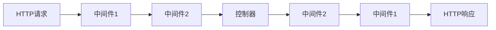

# 中间件机制

中间件是处理 HTTP 请求的过滤器，基于 PSR-15 标准实现，在请求到达控制器前后执行额外逻辑。

## 中间件概述

### 执行流程



### 主要用途

- **请求预处理** - 认证、授权、数据验证
- **响应后处理** - 添加头信息、日志记录
- **条件控制** - 根据条件决定是否继续处理

## 创建中间件

### 基本结构

```php
<?php
namespace App\Web\Middleware;

use Psr\Http\Message\ResponseInterface;
use Psr\Http\Message\ServerRequestInterface;
use Psr\Http\Server\MiddlewareInterface;
use Psr\Http\Server\RequestHandlerInterface;

class AuthMiddleware implements MiddlewareInterface
{
    public function process(ServerRequestInterface $request, RequestHandlerInterface $handler): ResponseInterface
    {
        // 请求前处理
        $token = $request->getHeaderLine('Authorization');
        
        if (empty($token)) {
            throw new \Core\Exception\UnauthorizedException('Token required');
        }
        
        // 验证 Token 并添加用户信息
        $user = $this->validateToken($token);
        $request = $request->withAttribute('user', $user);
        
        // 继续处理请求
        $response = $handler->handle($request);
        
        // 响应后处理
        return $response->withHeader('X-Auth-User', $user->name);
    }

    private function validateToken(string $token): object
    {
        // Token 验证逻辑
        return (object)['id' => 1, 'name' => 'User'];
    }
}
```

### 中间件类型

#### 1. 认证中间件

```php
class AuthMiddleware implements MiddlewareInterface
{
    public function process(ServerRequestInterface $request, RequestHandlerInterface $handler): ResponseInterface
    {
        $token = $this->extractToken($request);
        
        if (!$token || !$this->validateToken($token)) {
            throw new \Core\Exception\UnauthorizedException();
        }
        
        return $handler->handle($request);
    }
}
```

#### 2. 权限中间件

```php
class PermissionMiddleware implements MiddlewareInterface
{
    public function __construct(private string $permission) {}

    public function process(ServerRequestInterface $request, RequestHandlerInterface $handler): ResponseInterface
    {
        $user = $request->getAttribute('user');
        
        if (!$user || !$user->hasPermission($this->permission)) {
            throw new \Core\Exception\ForbiddenException();
        }
        
        return $handler->handle($request);
    }
}
```

#### 3. 限流中间件

```php
class RateLimitMiddleware implements MiddlewareInterface
{
    public function __construct(private int $maxRequests = 100, private int $timeWindow = 3600) {}

    public function process(ServerRequestInterface $request, RequestHandlerInterface $handler): ResponseInterface
    {
        $clientIp = $this->getClientIp($request);
        $key = "rate_limit:{$clientIp}";
        
        $count = \Core\App::cache()->get($key, 0);
        
        if ($count >= $this->maxRequests) {
            throw new \Core\Exception\TooManyRequestsException();
        }
        
        \Core\App::cache()->set($key, $count + 1, $this->timeWindow);
        
        return $handler->handle($request);
    }
}
```

#### 4. 日志中间件

```php
class LogMiddleware implements MiddlewareInterface
{
    public function process(ServerRequestInterface $request, RequestHandlerInterface $handler): ResponseInterface
    {
        $startTime = microtime(true);
        
        // 记录请求
        \Core\App::log()->info('Request started', [
            'method' => $request->getMethod(),
            'uri' => (string)$request->getUri(),
            'ip' => $this->getClientIp($request),
        ]);
        
        $response = $handler->handle($request);
        
        // 记录响应
        $duration = microtime(true) - $startTime;
        \Core\App::log()->info('Request completed', [
            'status' => $response->getStatusCode(),
            'duration' => round($duration * 1000, 2) . 'ms',
        ]);
        
        return $response;
    }
}
```

## 使用中间件

### 全局中间件

在 `Bootstrap.php` 中注册全局中间件：

```php
public function loadRoute(): void
{
    // 添加全局中间件
    $this->web->addMiddleware(new CorsMiddleware());
    $this->web->addMiddleware(new LogMiddleware());
    
    // 其他配置...
}
```

### 路由中间件

#### 在路由注解中使用

```php
use Core\Attribute\Route;

class UserController
{
    #[Route(methods: 'GET', pattern: '/users', middleware: ['auth'])]
    public function index(): ResponseInterface
    {
        // 需要认证的路由
    }

    #[Route(methods: 'POST', pattern: '/users', middleware: ['auth', 'admin'])]
    public function store(): ResponseInterface
    {
        // 需要认证和管理员权限的路由
    }
}
```

#### 在资源控制器中使用

```php
use Core\Attribute\Resource;

#[Resource(app: 'web', route: '/admin', middleware: ['auth', 'admin'])]
class AdminController extends Resources
{
    // 所有方法都会应用这些中间件
}
```

### 条件中间件

```php
class ConditionalMiddleware implements MiddlewareInterface
{
    public function process(ServerRequestInterface $request, RequestHandlerInterface $handler): ResponseInterface
    {
        // 只在 API 路由中执行
        if (str_starts_with($request->getUri()->getPath(), '/api/')) {
            // API 特定逻辑
            $request = $request->withHeader('X-API-Request', 'true');
        }
        
        return $handler->handle($request);
    }
}
```

## 内置中间件

### 1. CORS 中间件

```php
// 自动处理跨域请求
class CorsMiddleware implements MiddlewareInterface
{
    public function process(ServerRequestInterface $request, RequestHandlerInterface $handler): ResponseInterface
    {
        // OPTIONS 预检请求处理
        if ($request->getMethod() === 'OPTIONS') {
            return $this->buildCorsResponse();
        }
        
        $response = $handler->handle($request);
        
        return $this->addCorsHeaders($response);
    }
}
```

### 2. 语言中间件

```php
// 自动检测和设置语言
class LangMiddleware implements MiddlewareInterface
{
    public function process(ServerRequestInterface $request, RequestHandlerInterface $handler): ResponseInterface
    {
        $lang = $this->detectLanguage($request);
        \Core\App::trans()->setLocale($lang);
        
        return $handler->handle($request);
    }
}
```

### 3. 错误处理中间件

```php
// 统一错误处理和响应格式化
class ErrorMiddleware implements MiddlewareInterface
{
    public function process(ServerRequestInterface $request, RequestHandlerInterface $handler): ResponseInterface
    {
        try {
            return $handler->handle($request);
        } catch (\Throwable $e) {
            return $this->handleException($e, $request);
        }
    }
}
```

## 中间件管道

### 执行顺序

中间件按注册顺序执行，遵循"洋葱模型"：

```php
// 注册顺序
$app->addMiddleware(new LogMiddleware());     // 3. 最外层
$app->addMiddleware(new AuthMiddleware());   // 2. 中间层  
$app->addMiddleware(new CorsMiddleware());   // 1. 最内层

// 实际执行顺序
// 请求: Log -> Auth -> Cors -> 控制器
// 响应: 控制器 -> Cors -> Auth -> Log
```

### 中间件组合

```php
class MiddlewareStack
{
    public static function apiStack(): array
    {
        return [
            new CorsMiddleware(),
            new LogMiddleware(),
            new AuthMiddleware(),
            new RateLimitMiddleware(1000, 3600),
        ];
    }
    
    public static function adminStack(): array
    {
        return [
            ...self::apiStack(),
            new PermissionMiddleware('admin'),
        ];
    }
}
```

## 中间件参数

### 参数化中间件

```php
class CacheMiddleware implements MiddlewareInterface
{
    public function __construct(
        private int $ttl = 3600,
        private string $driver = 'default'
    ) {}

    public function process(ServerRequestInterface $request, RequestHandlerInterface $handler): ResponseInterface
    {
        $cacheKey = $this->generateCacheKey($request);
        $cache = \Core\App::cache($this->driver);
        
        // 尝试从缓存获取响应
        if ($cachedResponse = $cache->get($cacheKey)) {
            return $this->createResponseFromCache($cachedResponse);
        }
        
        $response = $handler->handle($request);
        
        // 缓存响应
        if ($response->getStatusCode() === 200) {
            $cache->set($cacheKey, $this->serializeResponse($response), $this->ttl);
        }
        
        return $response;
    }
}
```

### 使用参数化中间件

```php
#[Route(methods: 'GET', pattern: '/cached-data')]
public function cachedData(): ResponseInterface
{
    // 在路由中动态添加中间件
    $middleware = new CacheMiddleware(ttl: 1800, driver: 'redis');
    // 实现方式取决于具体需求
}
```

## 异步中间件

### 队列中间件

```php
class QueueMiddleware implements MiddlewareInterface
{
    public function process(ServerRequestInterface $request, RequestHandlerInterface $handler): ResponseInterface
    {
        $response = $handler->handle($request);
        
        // 异步处理后续任务
        if ($response->getStatusCode() === 201) {
            $data = json_decode((string)$response->getBody(), true);
            
            // 推送到队列
            \Core\App::queue()->push(new ProcessCreatedResourceJob($data));
        }
        
        return $response;
    }
}
```

## 测试中间件

### 单元测试

```php
use PHPUnit\Framework\TestCase;

class AuthMiddlewareTest extends TestCase
{
    public function testAuthenticatedRequest(): void
    {
        $middleware = new AuthMiddleware();
        $request = $this->createRequestWithToken('valid-token');
        $handler = $this->createMockHandler();
        
        $response = $middleware->process($request, $handler);
        
        $this->assertEquals(200, $response->getStatusCode());
    }
    
    public function testUnauthenticatedRequest(): void
    {
        $this->expectException(\Core\Exception\UnauthorizedException::class);
        
        $middleware = new AuthMiddleware();
        $request = $this->createRequestWithoutToken();
        $handler = $this->createMockHandler();
        
        $middleware->process($request, $handler);
    }
}
```

## 中间件最佳实践

### 1. 单一职责

```php
// ✅ 好的做法：单一职责
class AuthMiddleware implements MiddlewareInterface
{
    // 只负责认证
}

class LogMiddleware implements MiddlewareInterface  
{
    // 只负责日志
}

// ❌ 避免：多重职责
class AuthLogMiddleware implements MiddlewareInterface
{
    // 既做认证又做日志
}
```

### 2. 无状态设计

```php
// ✅ 好的做法：无状态
class RateLimitMiddleware implements MiddlewareInterface
{
    public function process(ServerRequestInterface $request, RequestHandlerInterface $handler): ResponseInterface
    {
        // 使用外部存储（Redis/Database）保存状态
        $count = \Core\App::cache()->get("rate_limit:{$ip}");
    }
}

// ❌ 避免：有状态
class BadRateLimitMiddleware implements MiddlewareInterface
{
    private array $requestCounts = []; // 状态数据
}
```

### 3. 合理的异常处理

```php
class SafeMiddleware implements MiddlewareInterface
{
    public function process(ServerRequestInterface $request, RequestHandlerInterface $handler): ResponseInterface
    {
        try {
            // 中间件逻辑
            return $handler->handle($request);
        } catch (\Exception $e) {
            // 记录错误但不阻断请求
            \Core\App::log()->error('Middleware error', ['error' => $e->getMessage()]);
            return $handler->handle($request);
        }
    }
}
```

### 4. 性能考虑

```php
class OptimizedMiddleware implements MiddlewareInterface
{
    public function process(ServerRequestInterface $request, RequestHandlerInterface $handler): ResponseInterface
    {
        // 快速路径：避免不必要的处理
        if ($this->shouldSkip($request)) {
            return $handler->handle($request);
        }
        
        // 延迟初始化昂贵的操作
        $service = $this->getService();
        
        return $handler->handle($request);
    }
}
```

通过合理使用中间件，可以实现关注点分离，让代码更加模块化和可维护。