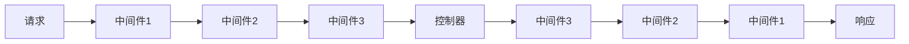

# 中间件

中间件是处理 HTTP 请求的过滤器，它们在请求到达控制器之前和响应返回给客户端之前执行。DuxLite 基于 PSR-15 标准实现中间件系统，提供了强大的请求处理机制。

::: tip 基于 SlimPHP 的优势
DuxLite 基于 SlimPHP 构建，这意味着您可以使用整个 SlimPHP 生态系统中的中间件包，享受社区的丰富资源和最佳实践。
:::

## 中间件概述

### 什么是中间件？

中间件是一种装饰器模式的实现，它可以在请求处理过程中执行额外的逻辑：

- **请求预处理** - 验证、授权、数据转换等
- **响应后处理** - 添加头信息、日志记录、缓存控制等
- **条件执行** - 根据条件决定是否继续处理请求

### 中间件执行流程



## 创建中间件

### 1. 基本中间件结构

所有中间件都必须实现 `MiddlewareInterface` 接口：

```php
<?php
namespace App\Middleware;

use Psr\Http\Message\ResponseInterface;
use Psr\Http\Message\ServerRequestInterface;
use Psr\Http\Server\MiddlewareInterface;
use Psr\Http\Server\RequestHandlerInterface;

class ExampleMiddleware implements MiddlewareInterface
{
    public function process(ServerRequestInterface $request, RequestHandlerInterface $handler): ResponseInterface
    {
        // 请求预处理
        $request = $request->withAttribute('example', 'value');

        // 调用下一个中间件/控制器
        $response = $handler->handle($request);

        // 响应后处理
        $response = $response->withHeader('X-Example', 'Processed');

        return $response;
    }
}
```

### 2. 带参数的中间件

中间件可以在构造函数中接收配置参数：

```php
<?php
namespace App\Middleware;

use Psr\Http\Message\ResponseInterface;
use Psr\Http\Message\ServerRequestInterface;
use Psr\Http\Server\MiddlewareInterface;
use Psr\Http\Server\RequestHandlerInterface;

class ConfigurableMiddleware implements MiddlewareInterface
{
    private array $config;

    public function __construct(array $config = [])
    {
        $this->config = array_merge([
            'default_value' => 'default',
            'timeout' => 30,
        ], $config);
    }

    public function process(ServerRequestInterface $request, RequestHandlerInterface $handler): ResponseInterface
    {
        // 使用配置参数
        $timeout = $this->config['timeout'];

        return $handler->handle($request);
    }
}
```

### 3. 依赖注入中间件

中间件可以通过构造函数注入服务：

```php
<?php
namespace App\Middleware;

use Core\App;
use Psr\Http\Message\ResponseInterface;
use Psr\Http\Message\ServerRequestInterface;
use Psr\Http\Server\MiddlewareInterface;
use Psr\Http\Server\RequestHandlerInterface;

class ServiceMiddleware implements MiddlewareInterface
{
    public function process(ServerRequestInterface $request, RequestHandlerInterface $handler): ResponseInterface
    {
        // 获取框架服务
        $cache = App::di()->get('cache.redis');
        $config = App::config('use');

        // 业务逻辑
        $cacheKey = 'middleware_' . md5($request->getUri()->getPath());
        if ($cache->has($cacheKey)) {
            // 处理缓存逻辑
        }

        return $handler->handle($request);
    }
}
```

## DuxLite 内置中间件

### 1. CorsMiddleware - CORS 处理

处理跨域请求和分页配置：

```php
// 源码位置：src/Middleware/CorsMiddleware.php
use Core\Middleware\CorsMiddleware;

// 使用方式
$middleware = new CorsMiddleware();
```

**构造函数参数：**
- 无参数构造函数

**功能特性：**
- 自动处理 OPTIONS 预检请求
- 设置 CORS 响应头（允许所有来源、方法、头信息）
- 集成 Laravel 分页器配置
- 支持跨域 Cookie（`Access-Control-Allow-Credentials: true`）

**自动添加的响应头：**
```text
Access-Control-Allow-Origin: *
Access-Control-Allow-Methods: *
Access-Control-Allow-Headers: *
Access-Control-Expose-Methods: *
Access-Control-Expose-Headers: *
Access-Control-Allow-Credentials: true
```

### 2. LangMiddleware - 国际化

语言检测和切换中间件：

```php
// 源码位置：src/Middleware/LangMiddleware.php
use Core\Middleware\LangMiddleware;

// 使用方式
$middleware = new LangMiddleware();
```

**构造函数参数：**
- 无参数构造函数

**功能特性：**
- 从 `Accept-Language` 请求头检测语言
- 解析客户端首选语言
- 将语言信息注入请求属性和 DI 容器
- 默认回退语言：`en-US`

**语言检测逻辑：**
```php
// 解析示例：
// Accept-Language: zh-CN,zh;q=0.9,en;q=0.8
// 解析结果: "zh-CN"

// Accept-Language: en-US;q=0.9,en;q=0.8
// 解析结果: "en-US"

// 空或无效时默认: "en-US"
```

**在控制器中获取语言：**
```php
public function index(ServerRequestInterface $request, ResponseInterface $response): ResponseInterface
{
    // 方式1：从请求属性获取
    $lang = $request->getAttribute('lang');

    // 方式2：从 DI 容器获取
    $lang = App::di()->get('lang');

    return $response;
}
```

### 3. AuthMiddleware - JWT 认证

基于 JWT 的用户认证中间件：

```php
// 源码位置：src/Auth/AuthMiddleware.php
use Core\Auth\AuthMiddleware;

// 使用方式
$middleware = new AuthMiddleware(
    app: 'admin',        // 必需：应用名称
    callback: $callback  // 可选：Token 刷新回调
);
```

**构造函数参数：**

| 参数 | 类型 | 必需 | 说明 |
|------|------|------|------|
| `app` | `string` | ✅ | 应用名称，用于验证 JWT 的 `sub` 声明 |
| `callback` | `\Closure\|null` | ❌ | Token 刷新时的回调函数 |

**功能特性：**
- JWT Token 验证（使用 Firebase JWT）
- 自动 Token 刷新（当 Token 在有效期的 1/3 时间后）
- 用户信息注入请求属性
- 支持通过路由注解控制认证（`auth: false` 跳过认证）
- 自动响应头设置新 Token

**配置要求：**
```toml
# config/use.toml
[app]
secret = "your-32-char-secret-key-here"
```

**使用示例：**
```php
// 创建认证中间件
$authMiddleware = new AuthMiddleware(
    app: 'admin',
    callback: function (string $oldToken, ?string $newToken) {
        // Token 刷新回调
        if ($newToken) {
            // 记录新 Token 或执行其他操作
            error_log("Token refreshed: $newToken");
        }
    }
);

// 在控制器中获取认证信息
public function dashboard(ServerRequestInterface $request, ResponseInterface $response): ResponseInterface
{
    $auth = $request->getAttribute('auth');  // JWT 解码后的数据
    $app = $request->getAttribute('app');    // 应用名称

    $userId = $auth['uid'] ?? null;
    $userRole = $auth['role'] ?? null;

    return $response;
}
```

**JWT Token 格式：**
```json
{
  "iss": "issuer",
  "sub": "admin",          // 必须匹配构造函数中的 app 参数
  "aud": "audience",
  "exp": 1234567890,       // 过期时间
  "iat": 1234567800,       // 签发时间
  "uid": "user_id",        // 自定义：用户ID
  "role": "administrator"  // 自定义：用户角色
}
```

### 4. PermissionMiddleware - 权限验证

基于角色的权限控制中间件：

```php
// 源码位置：src/Permission/PermissionMiddleware.php
use Core\Permission\PermissionMiddleware;

// 使用方式
$middleware = new PermissionMiddleware(
    name: 'admin.user',     // 必需：权限名称
    model: 'UserModel'      // 必需：模型类名
);
```

**构造函数参数：**

| 参数 | 类型 | 必需 | 说明 |
|------|------|------|------|
| `name` | `string` | ✅ | 权限组名称，通常格式为 `app.module` |
| `model` | `string` | ✅ | 关联的模型类名，用于权限检查 |

**功能特性：**
- 基于用户角色的权限验证
- 支持通过资源注解控制权限检查（`can: false` 跳过权限）
- 与 AuthMiddleware 集成，依赖认证信息
- 动态路由权限检查
- 灵活的权限配置

**使用示例：**
```php
// 用户管理权限中间件
$userPermission = new PermissionMiddleware(
    name: 'admin.user',
    model: 'App\\Models\\User'
);

// 文章管理权限中间件
$postPermission = new PermissionMiddleware(
    name: 'admin.post',
    model: 'App\\Models\\Post'
);
```

**权限检查逻辑：**
1. 检查认证状态（依赖 AuthMiddleware）
2. 检查注解控制（路由参数 `auth: false` 或资源参数 `can: false`）
3. 获取当前路由名称
4. 调用 `Can::check()` 进行权限验证

**权限检查流程：**
1. 获取用户认证信息（JWT 中的用户 ID）
2. 查询传入的模型类实例：`(new $model)->query()->find($uid)`
3. 获取用户模型的 `permission` 属性作为权限数组
4. 检查当前路由名称是否在用户权限数组中

**模型要求：**
```php
// 用户模型必须包含 permission 属性
class User extends Model
{
    // permission 应该是一个数组，包含用户拥有的权限名称
    protected $casts = [
        'permission' => 'array'
    ];

    // 或者通过访问器返回权限数组
    public function getPermissionAttribute($value)
    {
        return json_decode($value, true) ?? [];
    }
}
```

**在路由注解中控制认证：**
```php
use Core\Route\Attribute\Route;

class UserController
{
    #[Route('GET', '/users', auth: true)]  // 需要认证
    public function index(): ResponseInterface
    {
        // 需要认证的方法
    }

    #[Route('GET', '/public', auth: false)]  // 跳过认证
    public function publicInfo(): ResponseInterface
    {
        // 公开访问的方法
    }
}
```

**在资源注解中控制权限：**
```php
use Core\Resources\Attribute\Action;

class UserController
{
    #[Action('GET', '/users', auth: true, can: true)]   // 需要认证和权限
    public function list(): ResponseInterface
    {
        // 需要权限检查的方法
    }

    #[Action('GET', '/info', auth: false, can: false)]  // 跳过认证和权限
    public function info(): ResponseInterface
    {
        // 公开方法
    }
}
```

::: warning 注意
`Auth` 和 `Can` 不是独立的注解类，它们是路由注解中的参数：
- `Route` 注解只有 `auth` 参数
- `Action` 注解有 `auth` 和 `can` 参数
- 中间件通过 `Attribute::getRequestParams()` 获取这些参数值
:::

### 5. ApiMiddleware - API 签名验证

API 接口签名验证中间件：

```php
// 源码位置：src/Api/ApiMiddleware.php
use Core\Api\ApiMiddleware;

// 使用方式
$middleware = new ApiMiddleware(
    callback: function (string $accessKey): ?string {
        // 根据 AccessKey 返回对应的 SecretKey
        return match($accessKey) {
            'app_001' => 'secret_key_for_app_001',
            'app_002' => 'secret_key_for_app_002',
            default => null  // 返回 null 表示无效的 AccessKey
        };
    }
);
```

**构造函数参数：**

| 参数 | 类型 | 必需 | 说明 |
|------|------|------|------|
| `callback` | `callable` | ✅ | 密钥获取回调，接收 AccessKey 返回 SecretKey |

**功能特性：**
- HMAC-SHA256 签名验证
- 时间戳验证防重放攻击（默认 60 秒容错）
- 支持 URL 编码和非编码的查询参数
- 自动错误响应和异常处理

**请求头要求：**
```text
AccessKey: app_001                    // API 密钥ID
Content-Date: 1234567890             // Unix 时间戳
Content-MD5: abcdef123456...         // HMAC-SHA256 签名
```

**签名算法：**
```php
// 签名数据格式
$signData = [
    $request->getUri()->getPath(),           // 请求路径：/api/users
    urldecode($request->getUri()->getQuery()),  // 查询参数：name=john&age=25
    $timestamp                               // 时间戳：1234567890
];

// 生成签名
$signature = hash_hmac('SHA256', implode("\n", $signData), $secretKey);
```

**客户端签名示例：**
```php
// PHP 客户端示例
function generateSignature(string $path, string $query, int $timestamp, string $secretKey): string
{
    $signData = [
        $path,
        urldecode($query),
        $timestamp
    ];

    return hash_hmac('SHA256', implode("\n", $signData), $secretKey);
}

// 使用示例
$path = '/api/users';
$query = 'name=john&age=25';
$timestamp = time();
$secretKey = 'your_secret_key';

$signature = generateSignature($path, $query, $timestamp, $secretKey);

// 发送请求时设置头信息
$headers = [
    'AccessKey' => 'app_001',
    'Content-Date' => $timestamp,
    'Content-MD5' => $signature
];
```

**时间验证：**
```php
// 默认时间容错为 60 秒
// 可以通过继承修改 $time 属性来调整容错时间

class CustomApiMiddleware extends ApiMiddleware
{
    protected int $time = 300; // 5 分钟容错
}
```

**错误响应：**
- `402` - 签名验证失败
- `402` - 签名参数缺失
- `402` - AccessKey 无效
- `408` - 请求超时（时间戳验证失败，目前注释掉）

**完整使用示例：**
```php
// 创建 API 签名中间件
$apiMiddleware = new ApiMiddleware(function (string $accessKey): ?string {
    // 从数据库或配置文件获取密钥
    $keys = [
        'mobile_app' => 'mobile_secret_key_123',
        'web_app' => 'web_secret_key_456',
        'third_party' => 'third_party_secret_789'
    ];

    return $keys[$accessKey] ?? null;
});

// 在路由组中使用
$route = new Route([
    'middleware' => [$apiMiddleware]
]);

App::route()->set("api", $route);
```

## 中间件注册

### 1. 全局中间件

在 `src/Bootstrap.php` 中注册全局中间件：

```php
public static function loadApp(Slim\App $app): void
{
    // 全局 CORS 中间件
    $app->add(new CorsMiddleware());

    // 全局语言中间件
    $app->add(new LangMiddleware());
}
```

### 2. 路由组中间件

在创建 Route 实例时添加中间件：

```php
use Core\Route\Route;
use Core\Auth\AuthMiddleware;

// 创建带认证的路由组
$route = new Route([
    'middleware' => [
        AuthMiddleware::class,
        PermissionMiddleware::class
    ]
]);

App::route()->set("admin", $route);
```

### 3. 注解中间件

使用 `RouteGroup` 注解指定中间件：

```php
use Core\Route\Attribute\RouteGroup;
use Core\Auth\AuthMiddleware;

#[RouteGroup(app: 'admin', middleware: [AuthMiddleware::class])]
class AdminController
{
    // 控制器方法
}
```

### 4. 单个路由中间件

在路由定义时添加中间件：

```php
$app->get('/protected', function($request, $response, $args) {
    return $response;
})->add(new AuthMiddleware());
```

### 5. 资源中间件

在资源类中配置中间件：

```php
use Core\Resources\Resource;

class UserResource extends Resource
{
    protected array $middleware = [
        AuthMiddleware::class,
        PermissionMiddleware::class
    ];
}
```

## 高级用法

### 1. 条件中间件

根据条件动态应用中间件：

```php
use Psr\Http\Message\ResponseInterface;
use Psr\Http\Message\ServerRequestInterface;
use Psr\Http\Server\MiddlewareInterface;
use Psr\Http\Server\RequestHandlerInterface;

class ConditionalMiddleware implements MiddlewareInterface
{
    public function process(ServerRequestInterface $request, RequestHandlerInterface $handler): ResponseInterface
    {
        $path = $request->getUri()->getPath();

        // 只对 API 路径启用
        if (str_starts_with($path, '/api/')) {
            // 执行中间件逻辑
            $request = $request->withAttribute('is_api', true);
        }

        return $handler->handle($request);
    }
}
```

### 2. 中间件管道

组合多个中间件创建处理管道：

```php
class MiddlewarePipeline
{
    private array $middlewares = [];

    public function add(MiddlewareInterface $middleware): self
    {
        $this->middlewares[] = $middleware;
        return $this;
    }

    public function process(ServerRequestInterface $request, RequestHandlerInterface $handler): ResponseInterface
    {
        $pipeline = array_reduce(
            array_reverse($this->middlewares),
            function ($next, $middleware) {
                return function ($request) use ($middleware, $next) {
                    return $middleware->process($request, new class($next) implements RequestHandlerInterface {
                        private $handler;
                        public function __construct($handler) { $this->handler = $handler; }
                        public function handle(ServerRequestInterface $request): ResponseInterface {
                            return ($this->handler)($request);
                        }
                    });
                };
            },
            function ($request) use ($handler) {
                return $handler->handle($request);
            }
        );

        return $pipeline($request);
    }
}
```

### 3. 可配置中间件

基于配置文件的动态中间件行为：

```php
class ConfigurableRateLimitMiddleware implements MiddlewareInterface
{
    public function process(ServerRequestInterface $request, RequestHandlerInterface $handler): ResponseInterface
    {
        $config = App::config('rate_limit');

        $limit = $config->get('requests_per_minute', 60);
        $window = $config->get('window_seconds', 60);

        // 实现限流逻辑
        $clientIp = $request->getServerParams()['REMOTE_ADDR'] ?? 'unknown';

        if ($this->isRateLimited($clientIp, $limit, $window)) {
            // 返回 429 Too Many Requests
            $response = App::di()->get('response_factory')->createResponse(429);
            $response->getBody()->write('Rate limit exceeded');
            return $response;
        }

        return $handler->handle($request);
    }

    private function isRateLimited(string $clientIp, int $limit, int $window): bool
    {
        // 实现限流检查逻辑
        $cache = App::di()->get('cache.redis');
        $key = "rate_limit:$clientIp";

        $requests = $cache->get($key, 0);
        if ($requests >= $limit) {
            return true;
        }

        $cache->set($key, $requests + 1, $window);
        return false;
    }
}
```

## 中间件资源库

### 官方 SlimPHP 中间件

- **[Slim Twig View](https://github.com/slimphp/Twig-View)** - Twig 模板引擎
- **[Slim PHP View](https://github.com/slimphp/PHP-View)** - 原生 PHP 模板
- **[Slim HTTP Cache](https://github.com/slimphp/Slim-HttpCache)** - HTTP 缓存
- **[Slim CSRF](https://github.com/slimphp/Slim-Csrf)** - CSRF 保护
- **[Slim Flash](https://github.com/slimphp/Slim-Flash)** - Flash 消息

### 社区热门中间件

- **[PSR-7 Middlewares](https://github.com/middlewares)** - PSR-15 中间件集合
- **[Tuupola Middlewares](https://github.com/tuupola)** - 高质量中间件包
- **[Whoops](https://github.com/zeuxisoo/slim-whoops)** - 错误页面美化
- **[Rate Limiting](https://github.com/dyerc/slim-rate-limiting)** - 请求限流
- **[Monolog](https://github.com/Flynsarmy/Slim-Monolog)** - 日志中间件

::: tip 查找更多中间件
- **[Packagist](https://packagist.org/search/?q=slim%20middleware)** - 搜索 Slim 中间件包
- **[Awesome Slim](https://github.com/nekofar/awesome-slim)** - 精选 Slim 资源列表
- **[Slim 官方文档](https://www.slimframework.com/docs/v4/)** - 官方中间件文档
:::

## 最佳实践

### 1. 单一职责原则

每个中间件应该只负责一个特定的功能：

```php
// ✅ 好的做法：专门处理认证
class AuthenticationMiddleware implements MiddlewareInterface
{
    public function process(ServerRequestInterface $request, RequestHandlerInterface $handler): ResponseInterface
    {
        // 只处理用户认证
        if (!$this->isAuthenticated($request)) {
            return $this->unauthorizedResponse();
        }
        return $handler->handle($request);
    }
}

// ❌ 不好的做法：混合多个职责
class MixedMiddleware implements MiddlewareInterface
{
    public function process(ServerRequestInterface $request, RequestHandlerInterface $handler): ResponseInterface
    {
        // 既处理认证，又处理日志，又处理缓存...
        $this->authenticate($request);
        $this->logRequest($request);
        $this->checkCache($request);
        // ...
        return $handler->handle($request);
    }
}
```

### 2. 合理的执行顺序

中间件的顺序很重要，按照逻辑依赖关系排列：

```php
// 推荐的中间件顺序
$app->add(ErrorHandlingMiddleware::class);    // 1. 错误处理（最外层）
$app->add(CorsMiddleware::class);             // 2. CORS 处理
$app->add(SecurityHeadersMiddleware::class);   // 3. 安全头
$app->add(RateLimitingMiddleware::class);     // 4. 请求限流
$app->add(AuthenticationMiddleware::class);   // 5. 身份认证
$app->add(AuthorizationMiddleware::class);    // 6. 权限验证（依赖认证）
$app->add(LoggingMiddleware::class);          // 7. 日志记录
```

### 3. 性能优化

避免在中间件中执行耗时操作：

```php
class OptimizedMiddleware implements MiddlewareInterface
{
    public function process(ServerRequestInterface $request, RequestHandlerInterface $handler): ResponseInterface
    {
        // ✅ 提前检查，避免不必要的处理
        if (!$this->shouldProcess($request)) {
            return $handler->handle($request);
        }

        // ✅ 使用缓存避免重复计算
        $cacheKey = $this->getCacheKey($request);
        $result = $this->cache->get($cacheKey);

        if ($result === null) {
            $result = $this->expensiveOperation($request);
            $this->cache->set($cacheKey, $result, 300); // 缓存5分钟
        }

        return $handler->handle($request->withAttribute('result', $result));
    }
}
```

### 4. 错误处理

中间件应该正确处理异常：

```php
class SafeMiddleware implements MiddlewareInterface
{
    public function process(ServerRequestInterface $request, RequestHandlerInterface $handler): ResponseInterface
    {
        try {
            // 中间件逻辑
            $this->processRequest($request);

            $response = $handler->handle($request);

            // 后处理
            return $this->processResponse($response);

        } catch (AuthenticationException $e) {
            // 返回 401 响应
            return $this->createErrorResponse(401, 'Authentication failed');
        } catch (Exception $e) {
            // 记录日志并返回通用错误
            $this->logger->error('Middleware error: ' . $e->getMessage());
            return $this->createErrorResponse(500, 'Internal server error');
        }
    }
}
```

### 5. 测试友好

编写可测试的中间件：

```php
class TestableMiddleware implements MiddlewareInterface
{
    private LoggerInterface $logger;
    private CacheInterface $cache;

    public function __construct(LoggerInterface $logger, CacheInterface $cache)
    {
        $this->logger = $logger;
        $this->cache = $cache;
    }

    public function process(ServerRequestInterface $request, RequestHandlerInterface $handler): ResponseInterface
    {
        // 依赖通过构造函数注入，便于测试时模拟
        $userId = $this->extractUserId($request);

        if (!$this->isValidUser($userId)) {
            $this->logger->warning("Invalid user: $userId");
            return $this->createUnauthorizedResponse();
        }

        return $handler->handle($request);
    }

    // 将逻辑提取为独立方法，便于单元测试
    protected function extractUserId(ServerRequestInterface $request): ?string
    {
        return $request->getHeaderLine('X-User-ID') ?: null;
    }

    protected function isValidUser(?string $userId): bool
    {
        if (!$userId) return false;
        return $this->cache->has("user:$userId");
    }
}
```

## 常见问题解答

### Q: 如何调试中间件执行顺序？

**A:** 可以添加调试中间件记录执行流程：

```php
class DebugMiddleware implements MiddlewareInterface
{
    private string $name;

    public function __construct(string $name)
    {
        $this->name = $name;
    }

    public function process(ServerRequestInterface $request, RequestHandlerInterface $handler): ResponseInterface
    {
        error_log("Before: {$this->name}");
        $response = $handler->handle($request);
        error_log("After: {$this->name}");
        return $response;
    }
}
```

### Q: 中间件中如何获取路由参数？

**A:** 路由参数在路由解析后才可用：

```php
public function process(ServerRequestInterface $request, RequestHandlerInterface $handler): ResponseInterface
{
    $response = $handler->handle($request);

    // 路由参数在响应后可用
    $routeArguments = $request->getAttribute('__route__')->getArguments();

    return $response;
}
```

### Q: 如何在中间件中提前返回响应？

**A:** 直接返回响应对象，不调用 `$handler->handle()`：

```php
public function process(ServerRequestInterface $request, RequestHandlerInterface $handler): ResponseInterface
{
    if ($this->shouldBlock($request)) {
        // 提前返回，不继续处理
        $response = App::di()->get('response_factory')->createResponse(403);
        $response->getBody()->write('Access denied');
        return $response;
    }

    return $handler->handle($request);
}
```

中间件是 DuxLite 应用架构的重要组成部分，合理使用中间件可以让您的应用更加模块化、可维护和可扩展。结合 SlimPHP 生态系统的丰富资源，您可以快速构建功能强大的 Web 应用程序。