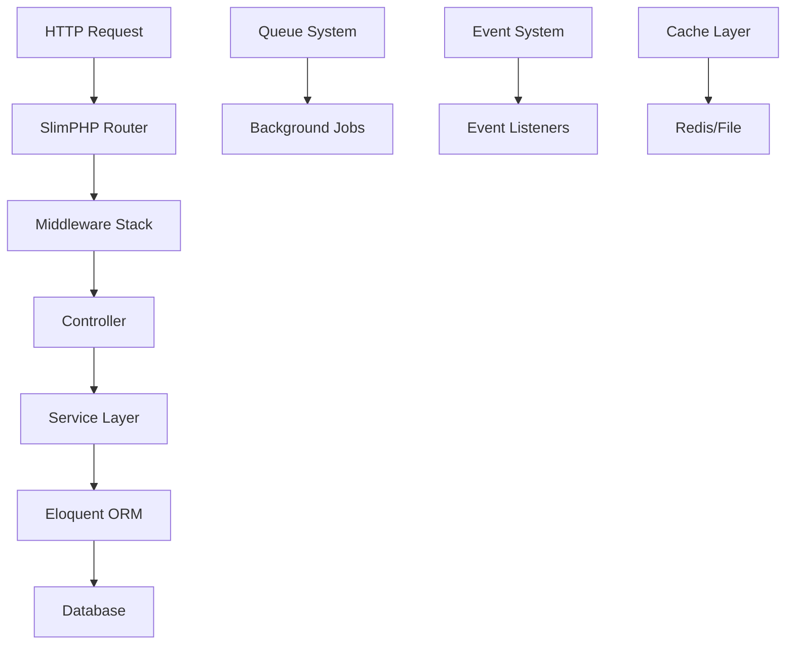

# 框架概述

DuxLite v2 是基于 **SlimPHP** 的现代化轻量级 Web 框架，以 **Eloquent ORM** 作为数据驱动核心。

## 核心特性

### 🚀 高性能轻量
- 基于 SlimPHP 4.x 微框架核心
- PHP 8.2+ 原生支持，充分利用类型系统
- 内置 OPcache 优化和 Worker 模式
- PSR-7/11/15 标准严格遵循

### 🏗️ 现代化开发
- **属性注解** - PHP 8+ Attribute 语法定义路由和权限
- **依赖注入** - 基于 PHP-DI 的容器管理
- **类型安全** - 联合类型、枚举等现代语法支持
- **模块化** - 清晰的模块架构和生命周期

### 🗄️ 强大数据层
- **Eloquent ORM** - Laravel 成熟的数据解决方案
- **数据库迁移** - 版本化结构管理
- **多驱动支持** - MySQL/PostgreSQL/SQLite
- **查询优化** - 连接池和缓存机制

### 🔒 企业级安全
- **JWT 认证** - 无状态身份验证
- **RBAC 权限** - 角色访问控制
- **输入验证** - 强类型数据验证
- **CORS 配置** - 跨域安全策略

### ⚡ 高级功能
- **异步队列** - Redis/AMQP 队列支持
- **事件系统** - 松耦合事件驱动架构
- **多级缓存** - 文件/Redis 缓存驱动
- **文件存储** - 本地/S3 统一存储接口

## 设计理念

### 轻量高效
最小化资源占用，保持功能完整性。适合从小型项目到大型企业应用。

### 避免过度封装
透明的组件选择，开发者可自由配置和扩展框架功能。

### 显式优于隐式
优先使用明确的静态方法调用（如 `App::db()`），提供完整的 IDE 支持。

## 技术架构



## 适用场景

### ✅ 推荐使用
- **API 服务** - RESTful API 和微服务开发
- **企业应用** - 中大型业务系统
- **快速原型** - MVP 和敏捷开发
- **现代化改造** - 传统应用升级

### ❌ 不适用场景
- 超大型单体应用（推荐微服务拆分）
- 对性能要求极致的场景（考虑 Go/Rust）
- 简单静态网站（使用静态生成器）

## 版本支持

| 版本 | PHP 要求 | 维护状态 | LTS 支持 |
|------|----------|----------|----------|
| v2.x | PHP 8.2+ | ✅ 活跃开发 | 2027年 |
| v1.x | PHP 8.0+ | 🔧 安全修复 | 2025年 |

## 快速体验

```bash
# 5分钟创建应用
composer create-project duxweb/dux-lite-starter my-app
cd my-app && php -S localhost:8000 -t public

# 访问测试
curl http://localhost:8000/hello
```

## 学习路径

1. **快速入门** → [快速开始](/guide/quick-start)
2. **核心概念** → [应用生命周期](/guide/lifecycle)
3. **实战开发** → [路由系统](/reference/api/routing)
4. **深入学习** → [数据库 ORM](/reference/data/database)

## 社区支持

- 📚 **文档** - 完整的中文文档和示例
- 🐛 **问题反馈** - [GitHub Issues](https://github.com/duxweb/dux-lite/issues)
- 💬 **讨论交流** - [GitHub Discussions](https://github.com/duxweb/dux-lite/discussions)
- 📝 **更新日志** - [Releases](https://github.com/duxweb/dux-lite/releases)